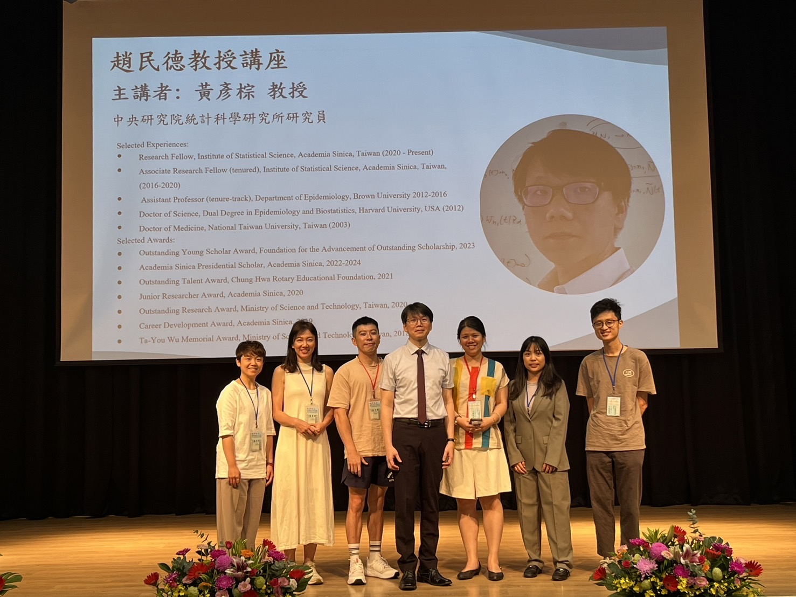

# About Me

Hello! I’m **Li-Sheng Zhuang (莊立勝)**, a second-year master’s student at the [**Institute of Statistics and Data Science**](https://stat.site.nthu.edu.tw/?Lang=zh-tw), **National Tsing Hua University**, Taiwan. I hold a bachelor’s degree in [**Applied Mathematics**](https://www.amath.nchu.edu.tw/) with a double major in **Finance** from **National Chung Hsing University**.

My expertise lies in **biostatistics**, with a particular focus on **survival analysis**, **causal inference**, and the **illness-death model**. My current master’s thesis investigates **causal mediation analysis** within the illness-death framework, integrating non-Markov structures and nonparametric estimation methods. I am advised by [**Dr. Yen-Tshung Huang**](https://www.stat.sinica.edu.tw/cht/index.php?act=researcher_manager&code=view&member=13) and [**Dr. Wen-Han Hwang**](https://stat.site.nthu.edu.tw/p/406-1327-170579,r406.php?Lang=zh-tw).

  
  
<em>Our Lab Members (2024)</em>

Thank you for visiting my website. Feel free to check out my [**GitHub**](https://github.com/Clisten0225) or [**LinkedIn**](https://www.linkedin.com/in/%E7%AB%8B%E5%8B%9D-%E8%8E%8A-767b66179/) for more details about my work.
